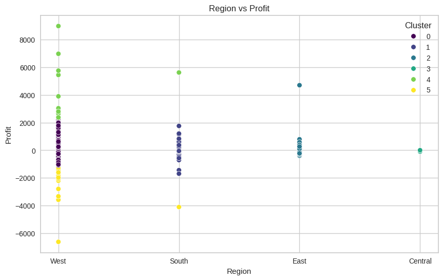

## Project Objectives
By utilizing clustering algorithms, the aim is to provide actionable insights into customer preferences and behavior patterns, which will ultimately drive more effective customer engagement and increase profitability.

- **Understand Customer Behavior:** 
  Identify key patterns in customer purchasing habits, such as frequency of purchases, total spend, product preferences, and discount sensitivity. 
- **Create Customer Segments:** 
  Group customers into distinct segments based on their transactional data (e.g., purchase history, frequency, order quantity, discount usage, and profitability).
- **Analyze Customer Segments:** 
  Understand the characteristics of each segment to tailor business strategies for different customer groups, such as high-value customers, occasional buyers, and discount-driven shoppers.
- **Provide Strategic Recommendations:** 
  Based on the segmentation results, suggest marketing, sales, and retention strategies to target each customer segment effectively.

## Link to Dataset
https://www.kaggle.com/datasets/jacopoferretti/superstore-dataset 

## Clustering options that were checked

| Label                                               |   Silhouette_Score |   Inertia |
|:----------------------------------------------------|-------------------:|----------:|
| Region & Profit                                     |           0.797905 |  419.305  |
| Region & Discount                                   |           0.77924  |  783.527  |
| Profit                                              |           0.668161 |  175.322  |
| Region & CLV                                        |           0.663073 |  239.31   |
| Discount                                            |           0.544651 |   68.2513 |
| Profit & CLV                                        |           0.419492 |  352.658  |
| Sales, Profit, Discount, Region, CLV, LifespanYears |           0.341398 | 2373.18   |

## Conclusion 
The best clustering option is Region & Profit. This clustering enables:
- Regional VIP Programs  
  Develop region-specific VIP support initiatives. Tailor services to
  meet local market needs and preferences.

- Profit-Based Prioritization  
  Allocate premium support resources to high-profit customers. Ensure  
  that all communications are timely and effective.
  top-tier service for most valuable clients.

- CLV-Driven Support  
  Offer personalized VIP experiences based on customer lifetime value.
  Invest in long-term relationship building.

  Full presentation is [here](Optimizing-Business-Strategies-Through-Clustering-Analysis.pdf)
